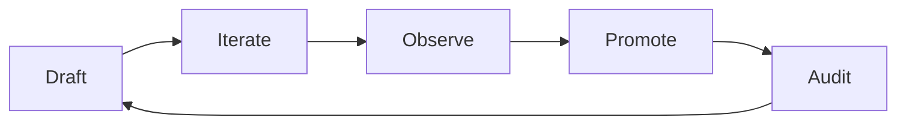

# Example walkthrough: Sam's first three weeks

A fictional user, start to finish, so you can see what the system looks like when it's grown. Sam is a freelance web developer who dreads client emails. Every name and email here is invented.



## Day 1: cold start

Sam finishes the quick start (folder created, templates copied, skill installed) and types:

```
/email tell my client Dana the launch is slipping a week because the payment integration failed review
```

The style guide is empty, so the cold-start rule fires. The skill asks one round of questions, including whether Sam can paste a sent email that sounds like him. He can't find one, so it drafts two short versions in different registers instead:

<table>
<tr><th>Version A (warmer)</th><th>Version B (more direct)</th></tr>
<tr><td>

> Hi Dana,
>
> I hope your week's going well! I wanted to give you a heads up on the launch. The payment integration didn't pass review, and fixing it properly pushes us about a week. I'm really sorry for the shift. The new target is Friday the 24th, and I'll confirm as soon as it clears.
>
> Thanks so much for your patience!
> Sam

</td><td>

> Hi Dana,
>
> Quick update: the payment integration failed review, and the fix pushes launch about a week. New target is Friday the 24th. I'll confirm as soon as it clears review.
>
> Sorry for the shift. Questions welcome.
>
> Sam

</td></tr>
</table>

Sam picks B: "this one, but 'Questions welcome' sounds like a slide deck." One revision later it's sent. The skill proposes the first log entries, Sam approves, and the style guide gets its first real data:

```markdown
## Observed patterns (auto-updated as we write)

- 2026-03-02 (Dana launch delay): picked the direct version over the warm one.
  Direct register, minimal preamble, no exclamation marks.
- 2026-03-02 (Dana launch delay): "Questions welcome" -> "Let me know if you
  want to talk it through". Compressed corporate shorthand reads cold to him.
```

## Week 1: corrections become data

Three more emails. Each one ends with a proposed log entry, and the before/after pairs pile up:

```markdown
- 2026-03-04 (invoice reminder): "circling back on this" -> "following up on
  this". Hates "circle back".
- 2026-03-05 (scope question): kept "My read is..." as an opener for opinions.
- 2026-03-07 (new lead reply): "I'd love to" -> "I'm glad to". Reserves "love"
  for things he means.
```

## Week 2: the first promotion

Sam edits out another "circle back" variant. Second occurrence, so the skill proposes a promotion instead of just logging:

> That's the second "circle back" family correction. Promote to the scrub list?
>
> ```markdown
> ## Email-specific tells (scrub list)
> - Em dashes and en dashes: a strong AI tell in email; use a period, comma, or parentheses.
> - "circle back", "circling back", "touch base": following-up language stays plain ("following up", "checking in").
> ```

Sam says yes. The log entries get suffixed `(promoted to scrub list, 2026-03-09)` and stay put as history. From now on the pre-output audit catches this family before Sam ever sees a draft.

Dana also replied twice this week, and both replies are sitting in the chain file. The skill mines them:

> Dana's replies are two lines, no greeting, signed "D". Propose a Recipients entry?
>
> ```markdown
> ### Dana (client, product lead at Meridian)
> - Rung 2. Greeting "Hi Dana,", sign-off first name only.
> - Register: direct, zero preamble. She reads on her phone; front-load the ask.
> - Replies in two lines, signs "D". Bullet lists get answered point by point,
>   paragraphs get "sounds good".
> - Prior drafts: 2026-03-02-dana-launch-delay.md (chain)
> ```

## Week 3: the payoff

Sam types `/email ask Dana to approve the revised timeline before Thursday`. The skill pulls Dana's entry, checks the chain to avoid repeating last week's phrasing, drafts at her register, and runs the audit against everything above.

<details>
<summary>The draft (accepted with zero edits)</summary>

> Hi Dana,
>
> The revised timeline is ready: launch Friday the 24th, staging preview Monday, final invoice at handoff. Could you approve it by Thursday? That keeps the 24th realistic.
>
> - Timeline doc: [link]
> - What changed: payment integration slot moved ahead of the content pass
>
> Sam

</details>

First draft, no corrections. Not because the model got smarter, but because the system now knows that Sam is direct, that Dana wants bullets and front-loaded asks, that "circle back" is banned, and what Sam's last three emails to her already said.

## What the style guide looks like now

<details>
<summary>Sam's email.md after three weeks (abridged)</summary>

```markdown
## Core voice
- Direct register, minimal preamble, no exclamation marks.
- Opinions open with "My read is...".
- Plain words for plain things; no compressed corporate shorthand.

## Phrasing bank
**Openers:** "Quick update:", "Following up on ___"
**Asks:** "Could you ___ by ___? That keeps ___ realistic."
**Sign-offs:** first name only (clients), "Thanks," (new leads)

## Email-specific tells (scrub list)
- Em dashes and en dashes
- "circle back" family
- "I'd love to" for routine willingness
- "Questions welcome"

## Recipients
### Dana (client, product lead at Meridian)
...

## Observed patterns
- 14 entries, 5 promoted, 1 superseded
```

</details>

Total explicit setup Sam did: zero. Every line above came out of emails he was sending anyway.
